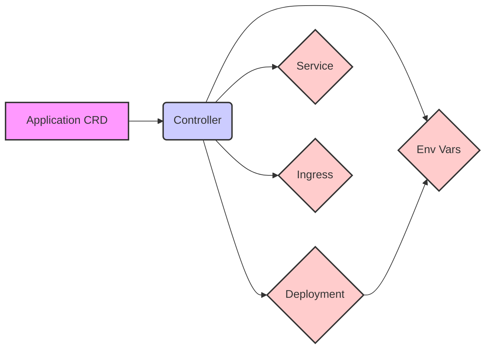

# Application Lifecycle Manager for Kubernetes

Demo Link

## 🔥 The Challenge: Complex Application Deployments in Kubernetes

Deploying and managing even moderately complex applications in Kubernetes often involves orchestrating multiple distinct resources: `Deployments` for running the application pods, `Services` for internal networking and load balancing, and `Ingresses` for external access. This manual management presents several challenges:

*   **Configuration Drift:** Keeping the specs of Deployments, Services, and Ingresses synchronized can be error-prone.
*   **Repetitive Toil:** Creating these resources for each new application or environment involves a lot of boilerplate YAML.
*   **Lifecycle Complexity:** Ensuring all related components are correctly created, updated, and cleaned up together during the application's lifecycle requires careful coordination.
*   **Lack of Abstraction:** Developers might need to understand the intricacies of multiple Kubernetes resources just to deploy a single application.

## 🎯 Goal: Simplify Application Delivery on Kubernetes

The primary goal of the Application Lifecycle Manager is to simplify and automate the deployment and management of applications on Kubernetes by:

1.  **Unified Application Definition:** Provide a single `Application` Custom Resource (CR) to define all necessary components (Deployment, Service, Ingress).
2.  **Automated Provisioning:** Automatically create and configure the underlying Kubernetes `Deployment`, `Service`, and `Ingress` resources based on the `Application` CR.
3.  **Consistent Lifecycle Management:** Ensure that when an `Application` CR is created, updated, or deleted, all its associated Kubernetes components are managed accordingly (created, updated, or garbage collected).
4.  **Declarative Configuration:** Allow users to declaratively manage their application's infrastructure through a high-level abstraction.
5.  **Reduced Boilerplate:** Minimize the amount of YAML users need to write to deploy an application.

## 🏆 Solution: The `Application` Controller

**Streamline Your Kubernetes Application Deployments with a Single Resource!**

The Application Lifecycle Manager introduces an `Application` Custom Resource Definition (CRD). Users create an `Application` resource specifying high-level details about their application, such as the container image, desired replicas, service port, and ingress routing rules.

The controller then takes over:
1.  **Watches** for `Application` CRs.
2.  **Provisions:**
    *   A Kubernetes `Deployment` to run the application pods, configured with the specified image, replicas, environment variables, resource requests/limits, and probes.
    *   A Kubernetes `Service` (defaulting to `ClusterIP`) to expose the application internally.
    *   Optionally, a Kubernetes `Ingress` resource to expose the application externally via a specified host and path.
3.  **Manages Lifecycle:**
    *   Updates the underlying components if the `Application` spec changes.
    *   Cleans up all created Deployment, Service, and Ingress resources when the `Application` CR is deleted (thanks to Kubernetes OwnerReferences).
4.  **Reports Status:** Updates the `status` of the `Application` CR with information about the provisioned resources, their readiness, and any relevant URLs.

## ✨ Key Features

*   **Declarative Application Management:** Define your entire application stack with a single `Application` CR.
*   **Automated Resource Provisioning:** Automatically creates and configures `Deployments`, `Services`, and optional `Ingresses`.
*   **Simplified Configuration:** Sensible defaults for many parameters, reducing boilerplate.
*   **Consistent Cleanup:** Ensures all managed resources are removed when an `Application` CR is deleted.
*   **Status Reporting:** Provides visibility into the state of the managed components.

## 🛠️ Technical Stack & Implementation

*   **Language:** Go (Golang)
*   **Framework:** Kubernetes Operator Pattern using Kubebuilder and Controller Runtime.
*   **Core Kubernetes Resources Managed:** `Deployments` (apps/v1), `Services` (core/v1), `Ingresses` (networking.k8s.io/v1).
*   **Custom Resource:** `Application` CRD (`apps.example.com/v1alpha1` - *adjust group as needed*).

### Architecture Diagram & Control Flow



1.  A **User** (or a CI/CD system) defines the desired state of their application by creating or updating an `Application` Custom Resource (CR) via the Kubernetes API Server.
2.  The **Application Controller**, running within a Pod in the cluster, continuously watches for changes to `Application` CRs.
3.  Based on the `Application` CR's specification, the Controller interacts with the Kubernetes API Server to create, update, or delete the necessary underlying Kubernetes resources:
    *   A `Deployment` to manage the application's pods.
    *   A `Service` to expose the application internally.
    *   An optional `Ingress` resource to expose the application externally.
4.  The Controller also updates the `status` subresource of the `Application` CR to reflect the current actual state of these managed components.

## 🚀 Quick Start Guide

### Prerequisites

*   Kubernetes cluster (v1.19+ recommended for Ingress v1)
*   `kubectl` configured to access your cluster
*   Go 1.21+ *(or your project's `go.mod` version)*
*   Kustomize v3.2.0+ *(often bundled with `kubectl`)*
*   Docker installed (if building the controller image locally)
*   An Ingress controller (like Nginx Ingress or Traefik) installed in your cluster if you plan to use the Ingress feature.

### Installation

1. **Provision Deployment Env - Kind Cluster:**
   ```sh
   kind create cluster
   ```

2.  **Clone the Repository (If building from source):**
    ```sh
    git clone https://github.com/sakiib/application-lifecycle-manager.git
    cd application-lifecycle-manager
    ```

3.  **Generate manifest & Install CRDs:**
    ```sh
    make generate
    make manifests
    make install
    ```

4.  **Build and Push the Controller Image (If not using a pre-built image):**
    Set the `IMG` variable to your desired image name and tag.
    ```sh
    export IMG=sakibalamin/application-lifecycle-manager:latest
    make docker-build docker-push
    ```

5.  **Deploy to Kubernetes:**
    This command installs the `Application` CRD and deploys the controller manager.
    ```sh
    make deploy IMG=sakibalamin/application-lifecycle-manager:latest
    ```
    *   **RBAC:** The controller is typically deployed with a `ClusterRole` allowing it to manage `Applications`, `Deployments`, `Services`, and `Ingresses` across namespaces where `Application` CRs are created. Ensure the ServiceAccount used by the controller has these permissions. The generated `Makefile` and Kustomize configurations handle this by default.

6.  **Verify Deployment:**
    Check that the controller pod is running (the namespace is usually `<project-name>-system`, e.g., `application-lifecycle-manager-system`).
    ```sh
    kubectl get pods -n application-lifecycle-manager-system
    ```

### Usage Example

1.  **Create an `Application` Resource:**
    Create a YAML file, for example, `my-web-app.yaml`:
    ```yaml
    apiVersion: apps.example.com/v1alpha1
    kind: Application
    metadata:
    name: my-sample-app
    namespace: application-lifecycle-manager-system
    spec:
    replicas: 1 # number of replicas for the deployment
    image: "nginx:1.25-alpine" # A simple image for testing
    containerPort: 80
    service:
        port: 8080 # Service port can be different from container port
        type: ClusterIP
    ingress:
        host: "my-sample-app.example.com" # You'll need to set up DNS/hosts file for this to resolve
        path: "/"
    envVars: # these env vars will be added to the pods
        - name: APP_ENV
        value: "production"
        - name: GREETING
        value: "Hello from Application CR"
    resources:
        requests:
        cpu: "100m"
        memory: "128Mi"
        limits:
        cpu: "200m"
        memory: "256Mi"
    ```

2.  **Apply the `Application` CR:**
    ```sh
    kubectl apply -f config/samples/apps_v1alpha1_application.yaml
    
    ```

3.  **Verify the Created Resources:**
    *   **Check the `Application` status:**
        ```sh
        kubectl get application my-nginx-app -n application-lifecycle-manager-system -o yaml
        # Look for status.deploymentName, status.serviceName, status.ingressURL, status.conditions
        ```
    *   **Check the Deployment:**
        ```sh
        kubectl get deployment my-nginx-app-deployment -n application-lifecycle-manager-system -o yaml 
        kubectl get pods -n application-lifecycle-manager-system -l app.kubernetes.io/instance=my-nginx-app 
        ```
    *   **Check the Service:**
        ```sh
        kubectl get service my-nginx-app-service -n application-lifecycle-manager-system -o yaml
        ```
    *   **Check the Ingress (if configured):**
        ```sh
        kubectl get ingress my-nginx-app-ingress -n application-lifecycle-manager-system -o yaml
        ```
        You should be able to access your application via the Ingress host (e.g., `http://my-nginx-app.yourdomain.com`) after setting up appropriate DNS or local `/etc/hosts` entries.

### Cleaning Up

1.  **Delete the `Application` CR:**
    This will trigger the controller to delete the associated `Deployment`, `Service`, and `Ingress` due to OwnerReferences.
    ```sh
    kubectl delete -f examples/my-web-app.yaml
    # or
    # kubectl delete application my-nginx-app -n default
    ```

2.  **Undeploy the Controller:**
    ```sh
    make undeploy
    ```

3.  **Uninstall CRDs:**
    ```sh
    make uninstall
    ```

## 📜 API Reference (`ApplicationSpec`)

*   `replicas` (*int32, optional, default: 1): Number of desired application pods.
*   `image` (string, required): Container image for the application.
*   `containerPort` (*int32, optional, default: 80): Port the container application listens on.
*   `service` (*ApplicationServiceSpec, optional): Configuration for the Kubernetes Service.
    *   `port` (*int32, optional): Port the Service will expose. Defaults to `containerPort`.
    *   `type` (*string, optional, default: "ClusterIP"): Type of Service (e.g., `ClusterIP`, `NodePort`, `LoadBalancer`).
*   `ingress` (*ApplicationIngressSpec, optional): Configuration for the Kubernetes Ingress. If omitted, no Ingress is created.
    *   `host` (string, required): Hostname for the Ingress rule.
    *   `path` (string, optional, default: "/"): Path for the Ingress rule.
    *   `pathType` (*string, optional, default: "Prefix"): Ingress path type (e.g., `Prefix`, `Exact`).
    *   `ingressClassName` (*string, optional): Name of the IngressClass to use.
    *   `annotations` (map[string]string, optional): Annotations for the Ingress resource.
    *   `tls` ([]networkingv1.IngressTLS, optional): TLS configuration for Ingress.
*   `envVars` ([]corev1.EnvVar, optional): Environment variables for the application containers.
*   `resources` (*corev1.ResourceRequirements, optional): CPU/Memory requests and limits for application containers.
*   `livenessProbe` (*corev1.Probe, optional): Liveness probe configuration.
*   `readinessProbe` (*corev1.Probe, optional): Readiness probe configuration.
*   `forceRegenerateNonce` (string, optional): Change this value to force a rollout/update of the deployment (useful if image tag is `:latest` and image changed, or for other manual triggers).

*(For `ApplicationStatus` fields, inspect a live CR with `kubectl describe application <name>` or `kubectl get application <name> -o yaml`)*

## ⚙️ Available `make` Commands

*   `make docker-build`: Build the controller Docker image.
*   `make docker-push`: Push the controller Docker image.
*   `make install`: Install the `Application` CRD into the cluster.
*   `make uninstall`: Remove the `Application` CRD from the cluster.
*   `make deploy`: Deploy the controller manager to the cluster.
*   `make undeploy`: Remove the controller manager from the cluster.
*   `make manifests`: Generate Kubernetes manifest files (CRDs, RBAC) from code.
*   `make generate`: Generate Go code (like deepcopy functions).
*   `make fmt`: Format Go source code.
*   `make vet`: Run Go static analysis (vet).
*   `make test`: Run unit and integration tests.
*   `make help`: Display help for all make targets.

## 🔍 Troubleshooting

*   **Controller Logs:**
    ```sh
    kubectl logs -f -n application-lifecycle-manager-system -l control-plane=controller-manager 
    ```
*   **`Application` CR Status:**
    ```sh
    kubectl get application <app-name> -n <app-namespace> -o yaml
    kubectl describe application <app-name> -n <app-namespace>
    ```
*   **Events:**
    ```sh
    kubectl get events -n <app-namespace> --field-selector involvedObject.kind=Application,involvedObject.name=<app-name>
    ```

## 🤝 Contributing

Contributions are welcome! If you'd like to contribute:
1.  Fork the repository.
2.  Create a new branch (`git checkout -b feature/your-feature-name`).
3.  Make your changes and commit them (`git commit -am 'Add some feature'`).
4.  Push to the branch (`git push origin feature/your-feature-name`).
5.  Open a Pull Request.

Please open an issue to discuss significant changes beforehand.

## 📄 License

Copyright 2025 [Your Name/Organization Here].

Licensed under the Apache License, Version 2.0 (the "License");
you may not use this file except in compliance with the License.
You may obtain a copy of the License at

    http://www.apache.org/licenses/LICENSE-2.0

Unless required by applicable law or agreed to in writing, software
distributed under the License is distributed on an "AS IS" BASIS,
WITHOUT WARRANTIES OR CONDITIONS OF ANY KIND, either express or implied.
See the License for the specific language governing permissions and
limitations under the License.

